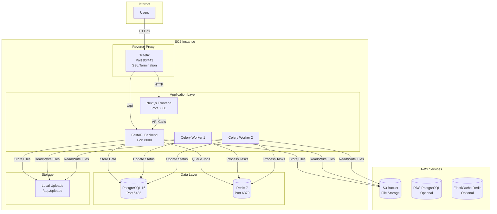
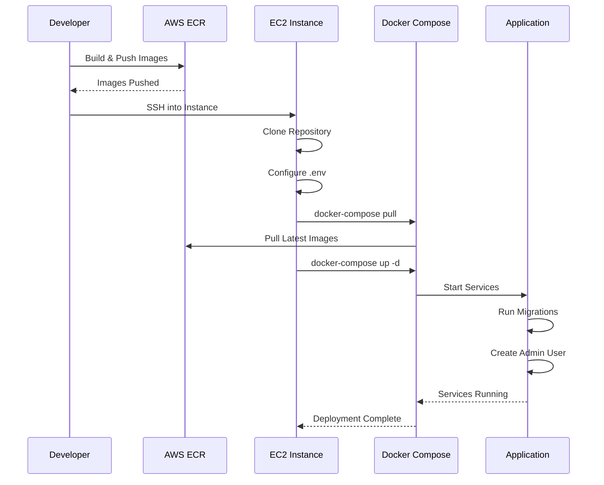
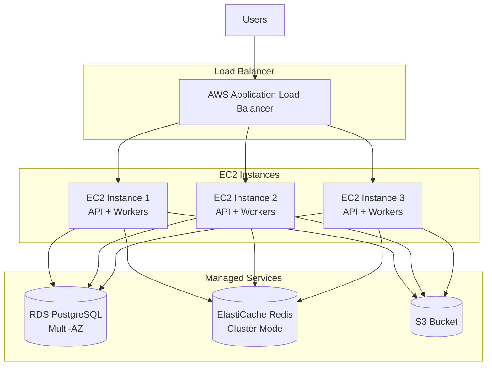

# PDF Extraction Tool - Deployment Guide

This guide covers deploying the PDF Extraction Tool to production environments, including AWS EC2 with S3 storage, PostgreSQL database, and Redis caching.

## 📋 Table of Contents

- [Prerequisites](#prerequisites)
- [Architecture Overview](#architecture-overview)
- [AWS S3 Setup](#aws-s3-setup)
- [EC2 Instance Setup](#ec2-instance-setup)
- [Application Deployment](#application-deployment)
- [Nginx Configuration](#nginx-configuration)
- [SSL/TLS Setup](#ssltls-setup)
- [Database Backup](#database-backup)
- [Monitoring and Maintenance](#monitoring-and-maintenance)
- [Scaling Considerations](#scaling-considerations)
- [Security Best Practices](#security-best-practices)
- [Troubleshooting](#troubleshooting)

## Prerequisites

- AWS Account with appropriate permissions
- Domain name (optional, for HTTPS)
- SSH access to EC2 instance
- Docker and Docker Compose installed on EC2
- AWS CLI configured (optional but recommended)
- Basic knowledge of Linux, Docker, and AWS services

## Architecture Overview

### Production Architecture



### Deployment Flow



## AWS S3 Setup

### 1.1 Create S3 Bucket

1. Navigate to AWS S3 Console
2. Click "Create bucket"
3. Configure bucket:
   - **Bucket name**: `pdf-extraction-tool-documents` (or your preferred name)
   - **Region**: Choose your deployment region (e.g., `us-east-1`)
   - **Block Public Access**: Keep enabled (we'll use IAM roles)
   - **Versioning**: Enable (recommended)
   - **Encryption**: Enable with AWS-managed keys (recommended)
   - **Object Lock**: Disable (unless required)

4. Click "Create bucket"

### 1.2 Configure S3 Bucket Policy

Create a bucket policy to allow your EC2 instance to access S3:

```json
{
  "Version": "2012-10-17",
  "Statement": [
    {
      "Sid": "AllowEC2Access",
      "Effect": "Allow",
      "Principal": {
        "AWS": "arn:aws:iam::YOUR_ACCOUNT_ID:role/ec2-s3-role"
      },
      "Action": [
        "s3:PutObject",
        "s3:GetObject",
        "s3:DeleteObject",
        "s3:ListBucket"
      ],
      "Resource": [
        "arn:aws:s3:::pdf-extraction-tool-documents/*",
        "arn:aws:s3:::pdf-extraction-tool-documents"
      ]
    }
  ]
}
```

**Alternative**: Use IAM User credentials (see next step)

### 1.3 Create IAM User (Alternative to IAM Role)

If not using IAM roles, create an IAM user:

1. Go to IAM Console → Users → Create user
2. User name: `pdf-extraction-s3-user`
3. Attach policy: `AmazonS3FullAccess` (or create custom policy with minimal permissions)
4. Create access key:
   - Go to "Security credentials" tab
   - Click "Create access key"
   - Choose "Application running outside AWS"
   - **Save Access Key ID and Secret Access Key** securely

## EC2 Instance Setup

### 2.1 Launch EC2 Instance

1. **Choose AMI**: Ubuntu 22.04 LTS or Amazon Linux 2023
2. **Instance Type**: 
   - Minimum: `t3.medium` (2 vCPU, 4 GB RAM)
   - Recommended: `t3.large` (2 vCPU, 8 GB RAM) or larger
   - For production: `t3.xlarge` or `m5.large`+
3. **Configure Instance**:
   - **Key pair**: Create or select existing key pair
   - **Network**: Default VPC or custom VPC
   - **Security Group**: Create new (see Step 2.2)
   - **Storage**: Minimum 20 GB (recommended: 30-50 GB)
4. **Launch Instance**

### 2.2 Configure Security Group

Create security group with these rules:

**Inbound Rules:**
```
Type            Protocol    Port Range    Source
SSH             TCP          22            Your IP / 0.0.0.0/0
HTTP            TCP          80            0.0.0.0/0
HTTPS           TCP          443           0.0.0.0/0
Custom TCP      TCP          8000          Your IP (for API access, optional)
Custom TCP      TCP          3000          Your IP (for frontend access, optional)
```

**Outbound Rules:**
```
Type            Protocol    Port Range    Destination
All Traffic     All          All           0.0.0.0/0
```

### 2.3 Connect to EC2 Instance

```bash
# Replace with your key and instance details
ssh -i /path/to/your-key.pem ubuntu@your-ec2-ip-address

# Or for Amazon Linux
ssh -i /path/to/your-key.pem ec2-user@your-ec2-ip-address
```

### 2.4 Install Docker and Docker Compose

**For Ubuntu:**

```bash
# Update system
sudo apt-get update

# Install Docker
curl -fsSL https://get.docker.com -o get-docker.sh
sudo sh get-docker.sh

# Add user to docker group
sudo usermod -aG docker $USER

# Install Docker Compose
sudo curl -L "https://github.com/docker/compose/releases/latest/download/docker-compose-$(uname -s)-$(uname -m)" -o /usr/local/bin/docker-compose
sudo chmod +x /usr/local/bin/docker-compose

# Verify installation
docker --version
docker-compose --version

# Logout and login again for group changes to take effect
```

**For Amazon Linux:**

```bash
# Update system
sudo yum update -y

# Install Docker
sudo yum install docker -y
sudo systemctl start docker
sudo systemctl enable docker
sudo usermod -aG docker ec2-user

# Install Docker Compose
sudo curl -L "https://github.com/docker/compose/releases/latest/download/docker-compose-$(uname -s)-$(uname -m)" -o /usr/local/bin/docker-compose
sudo chmod +x /usr/local/bin/docker-compose

# Verify installation
docker --version
docker-compose --version

# Logout and login again
```

## Application Deployment

### 3.1 Clone Repository

```bash
# On EC2 instance
cd /home/ubuntu  # or /home/ec2-user for Amazon Linux
git clone <your-repository-url> PDF-Extraction-Tool
cd PDF-Extraction-Tool
```

### 3.2 Configure Environment Variables

Create `.env` file:

```bash
cp .env.example .env
nano .env  # or use vi/vim
```

**Production `.env` configuration:**

```bash
# Database Configuration
DB_HOST=pdf-extraction-db
DB_PORT=5432
DB_NAME=pdf_extraction
DB_USER=postgres
DB_PASSWORD=<GENERATE_SECURE_PASSWORD>

# Redis Configuration
REDIS_BROKER_URL=redis://redis:6379/0
REDIS_BACKEND_URL=redis://redis:6379/1

# JWT Authentication
JWT_SECRET_KEY=<GENERATE_SECURE_SECRET_KEY>
ACCESS_TOKEN_EXPIRE_MINUTES=43200

# Admin User
ADMIN_EMAIL=admin@yourdomain.com
ADMIN_PASSWORD=<GENERATE_SECURE_PASSWORD>
ADMIN_NAME=Admin User

# AWS S3 Configuration
AWS_BUCKET_NAME=pdf-extraction-tool-documents
AWS_REGION=us-east-1
AWS_ACCESS_KEY_ID=<YOUR_AWS_ACCESS_KEY>
AWS_SECRET_ACCESS_KEY=<YOUR_AWS_SECRET_KEY>

# API Keys (for extractors)
OPENAI_API_KEY=<YOUR_OPENAI_KEY>
LLAMAPARSE_API_KEY=<YOUR_LLAMAPARSE_KEY>
MATHPIX_APP_ID=<YOUR_MATHPIX_ID>
MATHPIX_APP_KEY=<YOUR_MATHPIX_KEY>
ASSEMBLYAI_API_KEY=<YOUR_ASSEMBLYAI_KEY>

# Environment
STAGE=production

# Frontend API URL
NEXT_PUBLIC_API_URL=https://your-domain.com/api
# Or without domain:
# NEXT_PUBLIC_API_URL=http://localhost:8000

# Traefik Configuration (for docker-compose-prod.yml)
TRAEFIK_HOST=your-domain.com
TRAEFIK_ACME_EMAIL=admin@yourdomain.com
TRAEFIK_RATE_LIMIT_AVERAGE=10
TRAEFIK_RATE_LIMIT_BURST=20
TRAEFIK_RATE_LIMIT_PERIOD=1s

# AWS ECR Configuration (if using ECR)
AWS_ACCOUNT_ID=your-aws-account-id
AWS_REGION=us-east-1
ECR_REPOSITORY_NAME=pdf-extraction-tool
IMAGE_TAG=latest
FRONTEND_IMAGE_TAG=latest
```

**Generate secure passwords:**

```bash
# Generate random password
openssl rand -base64 32

# Generate JWT secret
python3 -c "import secrets; print(secrets.token_urlsafe(32))"
```

### 3.3 Create Uploads Directory

```bash
mkdir -p uploads
chmod 755 uploads
```

### 3.4 Build and Start Services

**Using Docker Compose (Production):**

```bash
# Build images
docker compose -f docker-compose-prod.yml build

# Start services
docker compose -f docker-compose-prod.yml up -d

# Check status
docker compose -f docker-compose-prod.yml ps

# View logs
docker compose -f docker-compose-prod.yml logs -f
```

**Using Pre-built Images from ECR:**

```bash
# Login to ECR
aws ecr get-login-password --region <AWS_REGION> | docker login --username AWS --password-stdin <AWS_ACCOUNT_ID>.dkr.ecr.<AWS_REGION>.amazonaws.com

# Pull images
docker compose -f docker-compose-prod.yml pull

# Start services
docker compose -f docker-compose-prod.yml up -d
```

### 3.5 Verify Deployment

```bash
# Check backend health
curl http://localhost:8000/

# Check frontend
curl http://localhost:3000

# View logs
docker compose -f docker-compose-prod.yml logs api
docker compose -f docker-compose-prod.yml logs worker
docker compose -f docker-compose-prod.yml logs frontend
```

## Nginx Configuration (Alternative to Traefik)

If not using Traefik, you can use Nginx as a reverse proxy:

### 4.1 Install Nginx

```bash
sudo apt-get install nginx -y  # Ubuntu
# or
sudo yum install nginx -y      # Amazon Linux
```

### 4.2 Configure Nginx

Create `/etc/nginx/sites-available/pdf-extraction`:

```nginx
upstream backend {
    server localhost:8000;
}

upstream frontend {
    server localhost:3000;
}

server {
    listen 80;
    server_name your-domain.com www.your-domain.com;

    # Frontend
    location / {
        proxy_pass http://frontend;
        proxy_http_version 1.1;
        proxy_set_header Upgrade $http_upgrade;
        proxy_set_header Connection 'upgrade';
        proxy_set_header Host $host;
        proxy_cache_bypass $http_upgrade;
    }

    # Backend API
    location /api {
        proxy_pass http://backend;
        proxy_http_version 1.1;
        proxy_set_header Host $host;
        proxy_set_header X-Real-IP $remote_addr;
        proxy_set_header X-Forwarded-For $proxy_add_x_forwarded_for;
        proxy_set_header X-Forwarded-Proto $scheme;
    }

    # Backend docs
    location /docs {
        proxy_pass http://backend;
        proxy_http_version 1.1;
        proxy_set_header Host $host;
    }

    # Backend redoc
    location /redoc {
        proxy_pass http://backend;
        proxy_http_version 1.1;
        proxy_set_header Host $host;
    }

    # File uploads (increase size limit)
    client_max_body_size 50M;
}
```

Enable site:

```bash
# Ubuntu
sudo ln -s /etc/nginx/sites-available/pdf-extraction /etc/nginx/sites-enabled/
sudo nginx -t
sudo systemctl restart nginx

# Amazon Linux
sudo ln -s /etc/nginx/conf.d/pdf-extraction.conf /etc/nginx/conf.d/pdf-extraction.conf
sudo nginx -t
sudo systemctl restart nginx
```

## SSL/TLS Setup

### 5.1 Using Traefik (Recommended)

Traefik automatically handles SSL certificates via Let's Encrypt. Just configure:

```bash
# In .env file
TRAEFIK_HOST=your-domain.com
TRAEFIK_ACME_EMAIL=admin@yourdomain.com
```

Traefik will automatically:
- Obtain SSL certificates
- Renew certificates automatically
- Redirect HTTP to HTTPS

### 5.2 Using Let's Encrypt with Nginx

**Install Certbot:**

```bash
# Ubuntu
sudo apt-get install certbot python3-certbot-nginx -y

# Amazon Linux
sudo yum install certbot python3-certbot-nginx -y
```

**Obtain SSL Certificate:**

```bash
sudo certbot --nginx -d your-domain.com -d www.your-domain.com
```

Follow prompts to configure automatic renewal.

**Test Auto-renewal:**

```bash
sudo certbot renew --dry-run
```

## Database Backup Setup

### 6.1 Create Backup Script

Create `/home/ubuntu/backup-db.sh`:

```bash
#!/bin/bash
BACKUP_DIR="/home/ubuntu/backups"
DATE=$(date +%Y%m%d_%H%M%S)
BACKUP_FILE="$BACKUP_DIR/pdf_extraction_$DATE.sql"

mkdir -p $BACKUP_DIR

docker compose -f /home/ubuntu/PDF-Extraction-Tool/docker-compose-prod.yml exec -T postgres pg_dump -U postgres pdf_extraction > $BACKUP_FILE

# Compress backup
gzip $BACKUP_FILE

# Upload to S3 (optional)
# aws s3 cp $BACKUP_FILE.gz s3://your-backup-bucket/database-backups/

# Keep only last 7 days of backups
find $BACKUP_DIR -name "*.gz" -mtime +7 -delete

echo "Backup completed: $BACKUP_FILE.gz"
```

Make executable:

```bash
chmod +x /home/ubuntu/backup-db.sh
```

### 6.2 Setup Cron Job

```bash
crontab -e
```

Add line for daily backups at 2 AM:

```
0 2 * * * /home/ubuntu/backup-db.sh >> /home/ubuntu/backup.log 2>&1
```

## Monitoring and Maintenance

### 7.1 View Logs

```bash
# All services
docker compose -f docker-compose-prod.yml logs -f

# Specific service
docker compose -f docker-compose-prod.yml logs -f api
docker compose -f docker-compose-prod.yml logs -f worker
docker compose -f docker-compose-prod.yml logs -f frontend

# Last 100 lines
docker compose -f docker-compose-prod.yml logs --tail=100 api
```

### 7.2 Monitor Resources

```bash
# Docker stats
docker stats

# Disk usage
df -h

# Memory usage
free -h

# System load
htop  # or top
```

### 7.3 Restart Services

```bash
# Restart specific service
docker compose -f docker-compose-prod.yml restart api

# Restart all services
docker compose -f docker-compose-prod.yml restart
```

### 7.4 Update Application

```bash
cd /home/ubuntu/PDF-Extraction-Tool

# Pull latest code
git pull origin main

# Rebuild and restart
docker compose -f docker-compose-prod.yml build
docker compose -f docker-compose-prod.yml up -d

# Check status
docker compose -f docker-compose-prod.yml ps
```

## Scaling Considerations

### 8.1 Horizontal Scaling

For high traffic, consider:



1. **Load Balancer**: Use AWS Application Load Balancer (ALB)
2. **Multiple EC2 Instances**: Deploy multiple instances behind ALB
3. **RDS PostgreSQL**: Use AWS RDS instead of containerized PostgreSQL
4. **ElastiCache Redis**: Use AWS ElastiCache for Redis
5. **Celery Workers**: Scale worker containers based on load

### 8.2 Vertical Scaling

- Increase EC2 instance size (t3.medium → t3.large → t3.xlarge)
- Add more CPU/RAM to handle concurrent requests
- Monitor performance metrics

### 8.3 Database Optimization

- Enable connection pooling
- Add database indexes for frequently queried columns
- Consider read replicas for heavy read workloads
- Regular VACUUM and ANALYZE operations

## Security Best Practices

1. **Firewall**: Configure security groups to restrict access
2. **SSH Keys**: Use SSH keys instead of passwords
3. **Secrets Management**: Use AWS Secrets Manager or Parameter Store
4. **Regular Updates**: Keep Docker images and system packages updated
5. **Backup**: Regular database backups (automated)
6. **SSL/TLS**: Always use HTTPS in production
7. **Environment Variables**: Never commit `.env` files
8. **IAM Roles**: Use IAM roles instead of access keys when possible
9. **Rate Limiting**: Configure rate limiting in Traefik/Nginx
10. **CORS**: Configure CORS properly for production domains
11. **Database Security**: Use strong passwords, enable SSL connections
12. **Container Security**: Regularly scan Docker images for vulnerabilities

## Troubleshooting

### Services Won't Start

```bash
# Check logs
docker compose -f docker-compose-prod.yml logs

# Check Docker status
docker ps -a

# Check disk space
df -h

# Check memory
free -h
```

### Database Connection Issues

```bash
# Check database logs
docker compose -f docker-compose-prod.yml logs postgres

# Test connection
docker compose -f docker-compose-prod.yml exec postgres psql -U postgres -d pdf_extraction

# Check database is running
docker compose -f docker-compose-prod.yml ps postgres
```

### S3 Upload Issues

```bash
# Verify AWS credentials
docker compose -f docker-compose-prod.yml exec api env | grep AWS

# Test S3 access
aws s3 ls s3://your-bucket-name

# Check IAM permissions
aws iam get-user
```

### High Memory Usage

```bash
# Check memory
free -h

# Restart services
docker compose -f docker-compose-prod.yml restart

# Scale down workers if needed
# Edit docker-compose-prod.yml to reduce worker instances
```

### SSL Certificate Issues

```bash
# Check Traefik logs
docker compose -f docker-compose-prod.yml logs traefik

# Verify DNS settings
nslookup your-domain.com

# Check certificate status
docker compose -f docker-compose-prod.yml exec traefik traefik version
```

## Production Checklist

- [ ] S3 bucket created and configured
- [ ] EC2 instance launched with appropriate size
- [ ] Security groups configured
- [ ] Environment variables set in `.env`
- [ ] Database password changed from default
- [ ] JWT secret key generated
- [ ] Admin credentials configured
- [ ] SSL certificate installed (Let's Encrypt/Traefik)
- [ ] Reverse proxy configured (Traefik/Nginx)
- [ ] Database backups scheduled
- [ ] Monitoring setup
- [ ] Logs accessible
- [ ] Health checks configured
- [ ] Firewall rules configured
- [ ] CORS configured for production domain
- [ ] Rate limiting configured
- [ ] All API keys configured
- [ ] File storage configured (S3 or local)

## Cost Optimization

1. **Reserved Instances**: Use EC2 Reserved Instances for long-term savings
2. **S3 Storage Classes**: Use S3 Intelligent-Tiering for automatic optimization
3. **Right-sizing**: Monitor and adjust instance sizes
4. **Auto-scaling**: Implement auto-scaling for cost efficiency
5. **Spot Instances**: Consider Spot Instances for non-critical workloads
6. **RDS Reserved Instances**: Use RDS Reserved Instances for database
7. **CloudWatch Monitoring**: Set up billing alerts

## Next Steps

- Review [README.md](./README.md) for project overview
- See [DEVELOPEMENT.md](./DEVELOPEMENT.md) for development setup
- Monitor application performance and logs
- Set up alerts for critical issues
- Plan for disaster recovery
- Implement CI/CD pipeline for automated deployments

---

For additional support, please refer to the main [README.md](./README.md) or open an issue on GitHub.
