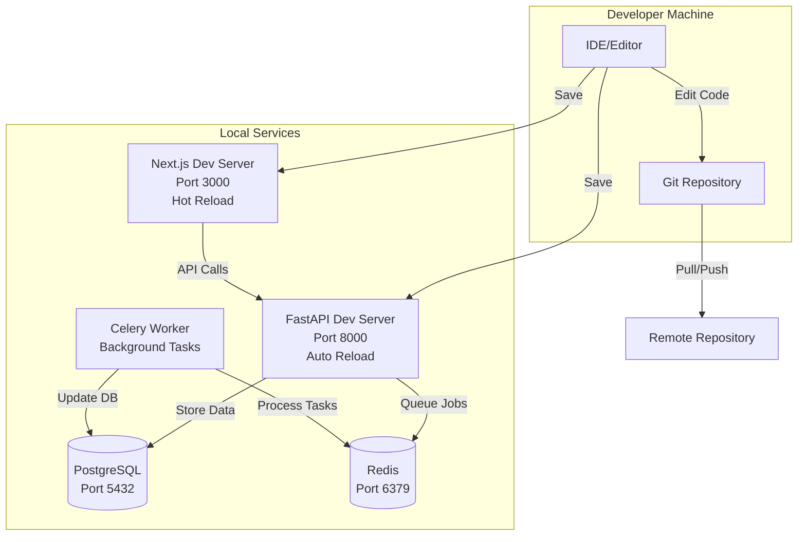
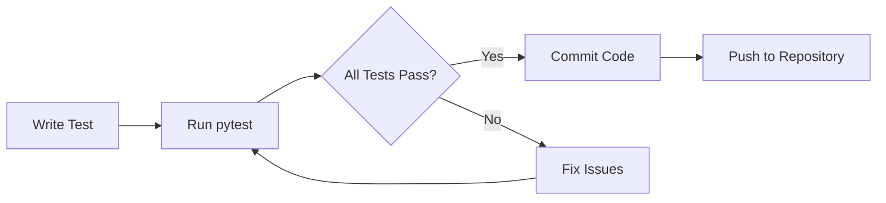
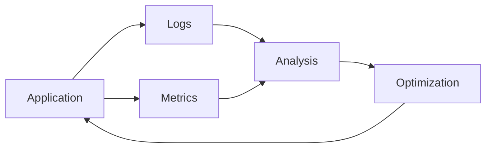

# PDF Extraction Tool - Development Guide

This guide covers local development setup, running the application, testing, and development best practices.

## 📋 Table of Contents

- [Prerequisites](#prerequisites)
- [Quick Start with Docker Compose](#quick-start-with-docker-compose)
- [Local Development (Without Docker)](#local-development-without-docker)
- [Development Workflow](#development-workflow)
- [Testing](#testing)
- [Code Style](#code-style)
- [Adding a New Extractor](#adding-a-new-extractor)
- [Debugging](#debugging)
- [Common Development Tasks](#common-development-tasks)
- [Environment Variables Reference](#environment-variables-reference)
- [Troubleshooting](#troubleshooting)
- [Performance Tips](#performance-tips)

## Prerequisites

### Required Software

- **Docker & Docker Compose**: For containerized development
- **Python 3.12+**: For backend development
- **Node.js 18+**: For frontend development
- **PostgreSQL 16+**: If running database outside Docker
- **Redis 7+**: If running Redis outside Docker

### Optional Tools

- **uv**: Modern Python package manager (recommended)
- **pre-commit**: Git hooks for code quality
- **pytest**: Testing framework
- **VS Code**: Recommended IDE with Python and TypeScript extensions

## Quick Start with Docker Compose

The easiest way to start developing is using Docker Compose:

### 1. Clone and Setup

```bash
git clone <repository-url>
cd PDF-Extraction-Tool
cp .env.example .env
```

### 2. Configure Environment Variables

Edit `.env` file with your local development settings:

```bash
# Database Configuration
DB_HOST=pdf-extraction-db
DB_PORT=5432
DB_NAME=pdf_extraction
DB_USER=postgres
DB_PASSWORD=dev_password

# Redis Configuration
REDIS_BROKER_URL=redis://redis:6379/0
REDIS_BACKEND_URL=redis://redis:6379/1

# JWT Authentication
JWT_SECRET_KEY=dev-secret-key-change-in-production-min-32-chars
ACCESS_TOKEN_EXPIRE_MINUTES=43200

# Admin User (created automatically on startup)
ADMIN_EMAIL=admin@example.com
ADMIN_PASSWORD=admin123
ADMIN_NAME=Admin User

# Environment Stage
STAGE=development

# API Keys (optional, needed for specific extractors)
OPENAI_API_KEY=your-openai-key-if-needed
LLAMAPARSE_API_KEY=your-llamaparse-key-if-needed
MATHPIX_APP_ID=your-mathpix-id-if-needed
MATHPIX_APP_KEY=your-mathpix-key-if-needed
ASSEMBLYAI_API_KEY=your-assemblyai-key-if-needed

# AWS S3 (optional, defaults to local storage)
# Leave empty to use local file storage
AWS_BUCKET_NAME=
AWS_REGION=
AWS_ACCESS_KEY_ID=
AWS_SECRET_ACCESS_KEY=

# Frontend
NEXT_PUBLIC_API_URL=http://localhost:8000
```

### 3. Start Services

```bash
docker compose up -d
```

This starts:
- **PostgreSQL**: Database on port 5432 (internal)
- **Redis**: Cache and message broker on port 6379 (internal)
- **Backend API**: FastAPI application on port 8000
- **Celery Worker**: Background task processor
- **Frontend**: Next.js application on port 3000

### 4. Verify Services

```bash
# Check service status
docker compose ps

# View logs
docker compose logs -f

# Check specific service logs
docker compose logs -f api
docker compose logs -f worker
docker compose logs -f frontend
```

### 5. Access Applications

- **Frontend**: http://localhost:3000
- **Backend API**: http://localhost:8000
- **API Documentation**: http://localhost:8000/docs
- **Alternative API Docs**: http://localhost:8000/redoc
- **Health Check**: http://localhost:8000/

## Local Development (Without Docker)

If you prefer to run services locally without Docker:

### Backend Setup

1. **Install Python dependencies**:

   Using `uv` (recommended):
   ```bash
   cd backend
   uv sync
   ```

   Or using pip:
   ```bash
   cd backend
   pip install -r requirements.txt
   ```

2. **Setup PostgreSQL**:

   Create database:
   ```bash
   createdb pdf_extraction
   ```

   Or using SQLite for development:
   ```bash
   # Set in .env: DATABASE_URL=sqlite:///./pdf-extraction.db
   ```

3. **Setup Redis**:

   Start Redis server:
   ```bash
   redis-server
   ```

   Or using Docker:
   ```bash
   docker run -p 6379:6379 redis:7-alpine
   ```

4. **Configure environment**:

   Create `.env` file in backend directory:
   ```bash
   cd backend
   cp .env.sample .env
   # Edit .env with your local settings
   ```

5. **Run backend API**:

   ```bash
   cd backend
   # Using uvicorn directly
   uv run uvicorn src.main:app --reload --host 0.0.0.0 --port 8000

   # Or using FastAPI CLI
   uv run fastapi dev src/main.py
   ```

6. **Run Celery worker** (in separate terminal):

   ```bash
   cd backend
   uv run celery -A src.tasks.celery_app worker --loglevel=info
   ```

### Frontend Setup

1. **Install dependencies**:

   ```bash
   cd frontend
   npm install
   # or
   yarn install
   # or
   pnpm install
   ```

2. **Configure environment**:

   Create `.env.local`:
   ```bash
   NEXT_PUBLIC_API_URL=http://localhost:8000
   ```

3. **Run development server**:

   ```bash
   npm run dev
   # or
   yarn dev
   # or
   pnpm dev
   ```

   Frontend will be available at http://localhost:3000

## Development Workflow

### Development Architecture



### Hot Reloading

- **Backend**: Uses `uvicorn --reload` for automatic reloading on code changes
- **Frontend**: Next.js has built-in hot module replacement (HMR)
- **Docker**: Volumes are mounted for live code changes in development mode

### Database Migrations

The application uses Alembic for database migrations. On startup, the app automatically runs migrations.

**Manual migration commands:**

```bash
# Create a new migration
cd backend
alembic revision --autogenerate -m "description of changes"

# Apply migrations
alembic upgrade head

# Rollback migration
alembic downgrade -1

# View migration history
alembic history
```

**Access database:**

```bash
# Using Docker
docker compose exec postgres psql -U postgres -d pdf_extraction

# Or from local PostgreSQL
psql -U postgres -d pdf_extraction
```

### Viewing Database

Using Adminer (if enabled) or psql:

```bash
# Using Docker
docker compose exec postgres psql -U postgres -d pdf_extraction

# Using Adminer (if configured)
# Access at http://localhost:8080
```

## Testing

### Running Tests

```bash
cd backend
uv run pytest tests/ -v

# Run specific test file
uv run pytest tests/test_existing_extractors.py -v

# Run with coverage
uv run pytest tests/ --cov=src --cov-report=html

# Run with coverage report
uv run pytest tests/ --cov=src --cov-report=term-missing
```

### Test Structure

```
backend/tests/
├── conftest.py           # Pytest configuration and fixtures
├── base_test.py          # Base test class
├── test_existing_extractors.py
├── test_llamaparse_extractor.py
├── test_markitdown_extractor.py
├── test_unstructured_extractor.py
└── test_runner.py
```

### Writing Tests

Follow the existing test patterns:

```python
import pytest
from src.extractor.pdf.pdfplumber_extractor import PDFPlumberExtractor

def test_extractor_basic():
    extractor = PDFPlumberExtractor()
    info = extractor.get_information()
    assert info["name"] == "pdfplumber"
    assert info["type"] == "sync"
```

### Test Flow



## Code Style

### Python

- Follow **PEP 8** style guide
- Use **type hints** where possible
- Maximum line length: **100 characters**
- Use `black` for formatting (if configured)
- Use `ruff` for linting (if configured)

**Formatting commands:**

```bash
# Format code
ruff format src/

# Lint code
ruff check src/

# Auto-fix issues
ruff check --fix src/
```

### TypeScript/JavaScript

- Follow **ESLint** rules
- Use **TypeScript** for type safety
- Maximum line length: **100 characters**
- Use **Prettier** for formatting (if configured)

**Formatting commands:**

```bash
cd frontend
npm run lint
npm run lint -- --fix
```

### Pre-commit Hooks

Install pre-commit hooks:

```bash
cd backend
pip install pre-commit
pre-commit install
```

Hooks will run automatically on `git commit`.

## Adding a New Extractor

### 1. Create Extractor Class

Create extractor class in `backend/src/extractor/pdf/` (or `audio/`, `image/`):

```python
from src.extractor.pdf.interface import PDFExtractorInterface
from typing import Union, Optional, Dict

class MyExtractor(PDFExtractorInterface):
    def get_information(self) -> dict:
        return {
            "name": "MyExtractor",
            "type": "sync",  # or "async"
            "supports": ["text", "tables"],
            "description": "Description of extractor"
        }
    
    def read(self, file_path: str, **kwargs) -> Union[str, dict]:
        # Implementation
        pass
    
    def get_status(self, job_id: str) -> str:
        # For sync: return "succeeded"
        # For async: check status
        return "succeeded"
    
    def get_result(self, job_id: str) -> Union[str, dict]:
        # Return extraction result
        pass
    
    def supports_webhook(self) -> bool:
        return False
    
    def handle_webhook(self, payload: dict) -> Union[str, dict]:
        raise NotImplementedError("Not supported")
    
    def calculate_cost(self, page_count: int, api_response: Optional[dict] = None) -> float:
        # Calculate cost per page
        return 0.0
```

### 2. Register in Factory

Add to `backend/src/factory/pdf.py` (or `audio.py`, `image.py`):

```python
from src.extractor.pdf.my_extractor import MyExtractor
from src.models.enums import PDFExtractorType

READER_MAP = {
    # ... existing extractors
    PDFExtractorType.MY_EXTRACTOR.value: MyExtractor,
}
```

### 3. Add to Enum

Add to `backend/src/models/enums.py`:

```python
class PDFExtractorType(str, Enum):
    # ... existing types
    MY_EXTRACTOR = "MyExtractor"
```

### 4. Add Tests

Create test in `backend/tests/`:

```python
def test_my_extractor():
    extractor = MyExtractor()
    info = extractor.get_information()
    assert info["name"] == "MyExtractor"
    # Add more tests
```

### 5. Update Documentation

Update relevant documentation files with the new extractor information.

## Debugging

### Backend Debugging

**Using VS Code:**

Create `.vscode/launch.json`:

```json
{
    "version": "0.2.0",
    "configurations": [
        {
            "name": "Python: FastAPI",
            "type": "python",
            "request": "launch",
            "program": "${workspaceFolder}/backend/src/main.py",
            "module": "uvicorn",
            "args": [
                "src.main:app",
                "--reload",
                "--host",
                "0.0.0.0",
                "--port",
                "8000"
            ],
            "jinja": true,
            "justMyCode": true
        }
    ]
}
```

**Using debugpy:**

```bash
python -m debugpy --listen 0.0.0.0:5678 -m uvicorn src.main:app --reload
```

### Frontend Debugging

**Using VS Code:**

Install "Debugger for Chrome" extension and create `.vscode/launch.json`:

```json
{
    "version": "0.2.0",
    "configurations": [
        {
            "name": "Next.js: debug server-side",
            "type": "node-terminal",
            "request": "launch",
            "command": "npm run dev"
        },
        {
            "name": "Next.js: debug client-side",
            "type": "chrome",
            "request": "launch",
            "url": "http://localhost:3000"
        }
    ]
}
```

### Viewing Logs

```bash
# Docker logs
docker compose logs -f api
docker compose logs -f worker

# Filter logs
docker compose logs api | grep ERROR
docker compose logs worker | grep "Task"
```

### Database Debugging

```bash
# Connect to database
docker compose exec postgres psql -U postgres -d pdf_extraction

# Run queries
SELECT * FROM documents LIMIT 10;
SELECT * FROM extraction_jobs WHERE status = 'processing';
SELECT COUNT(*) FROM users;
```

### Redis Debugging

```bash
# Connect to Redis CLI
docker compose exec redis redis-cli

# Monitor tasks
redis-cli MONITOR

# Check queue length
redis-cli LLEN celery

# List all keys
redis-cli KEYS *
```

## Common Development Tasks

### Restart Services

```bash
# Restart specific service
docker compose restart api

# Restart all services
docker compose restart

# Stop all services
docker compose down

# Start services
docker compose up -d
```

### Reset Database

```bash
# Stop services
docker compose down

# Remove volumes (WARNING: deletes all data)
docker compose down -v

# Restart
docker compose up -d
```

### Clear Redis Cache

```bash
docker compose exec redis redis-cli FLUSHALL
```

### Build Fresh Containers

```bash
# Rebuild without cache
docker compose build --no-cache

# Rebuild specific service
docker compose build --no-cache api
```

### View Service Status

```bash
# Check running containers
docker compose ps

# Check resource usage
docker stats

# Check logs
docker compose logs --tail=50 api
```

## Environment Variables Reference

### Development Essentials

```bash
STAGE=development
DB_HOST=pdf-extraction-db
DB_PORT=5432
DB_NAME=pdf_extraction
DB_USER=postgres
DB_PASSWORD=dev_password
REDIS_BROKER_URL=redis://redis:6379/0
REDIS_BACKEND_URL=redis://redis:6379/1
JWT_SECRET_KEY=dev-secret-key-change-me-min-32-chars
ADMIN_EMAIL=admin@example.com
ADMIN_PASSWORD=admin123
ADMIN_NAME=Admin User
```

### Optional Configuration

```bash
# File uploads
UPLOADS_DIR=/app/uploads
SHARED_VOLUME_PATH=/app/shared_volume

# AWS S3 (leave empty for local storage)
AWS_BUCKET_NAME=
AWS_REGION=
AWS_ACCESS_KEY_ID=
AWS_SECRET_ACCESS_KEY=

# External API Keys
OPENAI_API_KEY=
LLAMAPARSE_API_KEY=
MATHPIX_APP_ID=
MATHPIX_APP_KEY=
ASSEMBLYAI_API_KEY=

# Frontend
NEXT_PUBLIC_API_URL=http://localhost:8000
```

## Troubleshooting

### Port Already in Use

```bash
# Find process using port
lsof -i :8000
lsof -i :3000
lsof -i :5432

# Kill process
kill -9 <PID>

# Or change ports in docker-compose.yml
```

### Database Connection Issues

```bash
# Check database is running
docker compose ps postgres

# Check connection
docker compose exec postgres pg_isready -U postgres

# View database logs
docker compose logs postgres

# Check environment variables
docker compose exec api env | grep DB_
```

### Redis Connection Issues

```bash
# Check Redis is running
docker compose ps redis

# Test connection
docker compose exec redis redis-cli PING

# View Redis logs
docker compose logs redis

# Check environment variables
docker compose exec api env | grep REDIS
```

### Celery Worker Not Processing Tasks

```bash
# Check worker logs
docker compose logs worker

# Verify Redis connection
docker compose exec redis redis-cli PING

# Restart worker
docker compose restart worker

# Check worker status
docker compose exec worker celery -A src.tasks.celery_app status
```

### File Upload Issues

```bash
# Check uploads directory permissions
ls -la uploads/

# Ensure directory exists
mkdir -p uploads
chmod 755 uploads

# Check Docker volume mounting
docker compose exec api ls -la /app/uploads
```

### Frontend Build Issues

```bash
# Clear Next.js cache
cd frontend
rm -rf .next
rm -rf node_modules
npm install
npm run dev

# Check for TypeScript errors
npm run build
```

### Import Errors

```bash
# Backend: Reinstall dependencies
cd backend
uv sync
# or
pip install -r requirements.txt

# Frontend: Reinstall dependencies
cd frontend
rm -rf node_modules package-lock.json
npm install
```

## Performance Tips

1. **Use Redis caching**: Configure Redis for frequently accessed data
2. **Optimize database queries**: Use indexes and async queries
3. **Monitor Celery workers**: Scale workers based on load
4. **Use connection pooling**: Configure database connection pools
5. **Enable response compression**: Configure gzip compression in nginx
6. **Optimize frontend**: Use code splitting and lazy loading
7. **Cache API responses**: Use TanStack Query caching strategies
8. **Monitor performance**: Use browser DevTools and backend profiling

### Performance Monitoring



## Next Steps

- Review [README.md](./README.md) for project overview
- See [DEPLOYMENT.md](./DEPLOYMENT.md) for production deployment
- Check API documentation at `/docs` for endpoint details
- Explore extractor implementations in `backend/src/extractor/`
- Review [Backend README](backend/README.md) for backend-specific details
- Review [Frontend README](frontend/README.md) for frontend-specific details

---

Happy coding! 🚀
