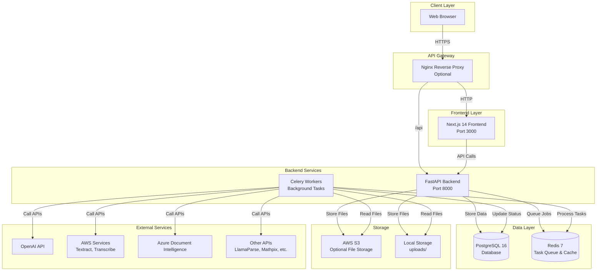
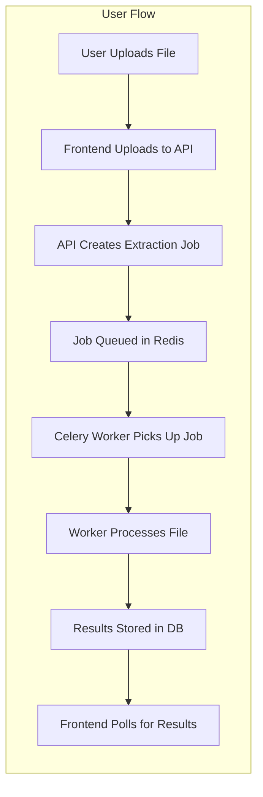
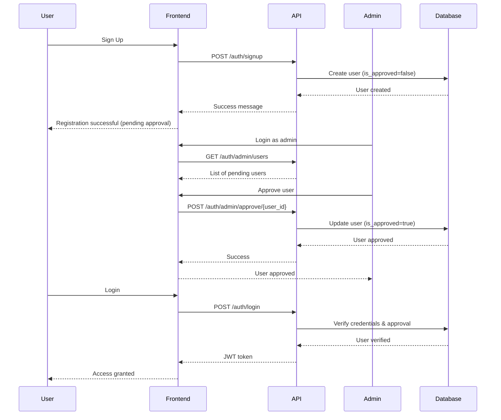

# PDF Extraction Tool

[](https://opensource.org/licenses/MIT)
[](https://www.python.org/downloads/)
[](https://nextjs.org/)
[](https://fastapi.tiangolo.com/)

A comprehensive, AI-powered document and audio extraction platform that supports multiple extraction engines for PDFs, images, and audio files. Built with FastAPI (backend) and Next.js 14 (frontend), featuring real-time processing, user management, and project organization.

## 🎯 Overview

This platform enables users to extract text, tables, and structured data from PDFs, images, and audio files using a variety of extraction engines. It supports both traditional libraries and modern AI-powered services, allowing users to choose the best tool for their specific use case.

### Key Features

- **Multi-Engine Support**: 15+ extraction engines for PDFs, images, and audio
- **Real-time Processing**: Background job processing with Celery and Redis
- **Project Management**: Organize documents into projects with detailed tracking
- **User Management**: Admin approval workflow with role-based access control
- **Modern UI**: Responsive Next.js frontend with real-time monitoring
- **Cost Tracking**: Per-page pricing tracking for each extraction engine
- **Annotation System**: Add feedback and ratings to extraction results
- **Multiple File Types**: Support for PDFs, images (PNG, JPG, etc.), and audio files (MP3, WAV, etc.)

## 🏗️ Architecture



### System Architecture



## 📦 Project Structure

```
PDF-Extraction-Tool/
├── backend/              # FastAPI backend service
│   ├── src/             # Source code
│   │   ├── auth/        # Authentication & authorization
│   │   ├── extractor/   # Extraction engine implementations
│   │   │   ├── pdf/     # PDF extraction engines
│   │   │   ├── audio/   # Audio transcription engines
│   │   │   └── image/   # Image OCR engines
│   │   ├── factory/     # Factory modules for extractors
│   │   ├── models/      # Database models & schemas
│   │   ├── routes/      # API route handlers
│   │   ├── tasks.py     # Celery task definitions
│   │   └── main.py      # FastAPI application entry point
│   ├── tests/           # Test suite
│   ├── alembic/         # Database migrations
│   ├── Dockerfile       # Container configuration
│   └── requirements.txt # Python dependencies
├── frontend/            # Next.js frontend application
│   ├── app/             # Next.js App Router
│   │   ├── document/    # PDF extraction features
│   │   ├── audio/       # Audio transcription features
│   │   ├── image/       # Image OCR features
│   │   ├── admin/       # Admin management
│   │   └── components/  # Reusable UI components
│   ├── public/          # Static assets
│   └── package.json     # Node.js dependencies
├── docker-compose.yml   # Development Docker orchestration
├── docker-compose-prod.yml # Production Docker orchestration
├── nginx.conf           # Nginx configuration (optional)
└── README.md            # This file
```

## 🚀 Quick Start

### Prerequisites

- **Docker and Docker Compose** (recommended)
- **Node.js 18+** (for local frontend development)
- **Python 3.12+** (for local backend development)
- **Redis 7+** (for task queue)
- **PostgreSQL 16+** (or SQLite for development)

### Using Docker Compose (Recommended)

1. **Clone the repository**:
```bash
git clone https://github.com/yourusername/PDF-Extraction-Tool.git
cd PDF-Extraction-Tool
```

2. **Create environment file**:
Create a `.env` file in the root directory:
```bash
# Database
DB_USER=postgres
DB_PASSWORD=your-secure-password
DB_NAME=pdf_extraction
DB_HOST=pdf-extraction-db
DB_PORT=5432

# JWT Authentication
JWT_SECRET_KEY=your-secret-key-here-min-32-chars
ACCESS_TOKEN_EXPIRE_MINUTES=43200

# Admin credentials (created automatically on first startup)
ADMIN_EMAIL=admin@yourcompany.com
ADMIN_PASSWORD=your-secure-password
ADMIN_NAME=Admin User

# Redis
REDIS_BROKER_URL=redis://redis:6379/0
REDIS_BACKEND_URL=redis://redis:6379/1

# AWS S3 (optional - leave empty for local storage)
AWS_ACCESS_KEY_ID=your-access-key
AWS_SECRET_ACCESS_KEY=your-secret-key
AWS_REGION=us-east-1
AWS_BUCKET_NAME=your-bucket-name

# OpenAI (for GPT extractors)
OPENAI_API_KEY=your-openai-api-key

# Other API Keys (optional)
LLAMAPARSE_API_KEY=your-llamaparse-key
MATHPIX_APP_ID=your-mathpix-id
MATHPIX_APP_KEY=your-mathpix-key
ASSEMBLYAI_API_KEY=your-assemblyai-key

# Environment
STAGE=development

# Frontend
NEXT_PUBLIC_API_URL=http://localhost:8000
```

3. **Start all services**:
```bash
docker-compose up --build
```

This will start:
- **Backend API** on `http://localhost:8000`
- **Frontend** on `http://localhost:3000`
- **PostgreSQL** database (internal)
- **Redis** for task queue (internal)
- **Celery Worker** for background processing

4. **Access the application**:
- Frontend: [http://localhost:3000](http://localhost:3000)
- API Docs: [http://localhost:8000/docs](http://localhost:8000/docs)
- ReDoc: [http://localhost:8000/redoc](http://localhost:8000/redoc)
- Health Check: [http://localhost:8000/](http://localhost:8000/)

### Manual Setup

For detailed setup instructions, see:
- [Backend README](backend/README.md) - Backend setup and configuration
- [Frontend README](frontend/README.md) - Frontend setup and development
- [Development Guide](DEVELOPEMENT.md) - Complete development setup

## 📦 Extraction Engines

### PDF Extractors

| Engine | Type | Best For | Cost |
|--------|------|----------|------|
| PyPDF2 | Traditional | Basic text extraction | Free |
| PyMuPDF | Traditional | Fast extraction, image rendering | Free |
| PDFPlumber | Traditional | Precise text, table detection | Free |
| Camelot | Table Extraction | Structured table data | Free |
| Tabula | Table Extraction | Complex table structures | Free |
| Tesseract | OCR | Scanned documents | Free |
| AWS Textract | OCR | High-accuracy OCR, forms | Pay-per-page |
| Mathpix | AI-Powered | Mathematical equations, LaTeX | Pay-per-request |
| Unstructured | AI-Powered | Document parsing, chunking | Free |
| MarkItDown | AI-Powered | Universal document converter | Free |
| LlamaParse | AI-Powered | RAG-optimized parsing | Pay-per-page |
| OpenAI GPT-4o | AI-Powered | Complex analysis, summarization | Pay-per-token |
| OpenAI GPT-4o-mini | AI-Powered | Cost-effective analysis | Pay-per-token |
| OpenAI GPT-5 | AI-Powered | Advanced document understanding | Pay-per-token |
| Azure Document Intelligence | AI-Powered | Enterprise document processing | Pay-per-page |

### Audio Extractors

| Engine | Type | Best For | Cost |
|--------|------|----------|------|
| Whisper (OpenAI) | AI-Powered | High-accuracy transcription | Pay-per-minute |
| AssemblyAI | AI-Powered | Real-time transcription, speaker diarization | Pay-per-minute |
| AWS Transcribe | AI-Powered | Scalable transcription, multiple languages | Pay-per-minute |

### Image Extractors

| Engine | Type | Best For | Cost |
|--------|------|----------|------|
| Tesseract | OCR | Text from images | Free |
| AWS Textract | OCR | High-accuracy image OCR | Pay-per-page |
| Mathpix | AI-Powered | Mathematical equations in images | Pay-per-request |
| OpenAI GPT-4o | AI-Powered | Image understanding, text extraction | Pay-per-image |
| Azure Document Intelligence | AI-Powered | Document images, forms | Pay-per-page |

## 🔐 Authentication & User Management

### User Registration Flow



### Roles

- **Admin**: Full access including user management, can approve/activate users
- **User**: Standard access to projects and documents, can create and manage their own projects

## 🚀 Deployment

### Production Deployment

For detailed deployment instructions, see [DEPLOYMENT.md](DEPLOYMENT.md).

#### Quick Production Setup

```bash
# Build and run production services
docker-compose -f docker-compose-prod.yml up --build -d
```

#### Production Considerations

- Use PostgreSQL instead of SQLite
- Configure Redis clustering for high availability
- Set up AWS S3 for file storage
- Use environment-specific configuration
- Implement proper logging and monitoring
- Set up SSL/TLS termination (nginx or Traefik)
- Configure CORS properly for production domains
- Use strong passwords and JWT secrets
- Enable database backups

## 🧪 Testing

### Backend Tests

```bash
cd backend
uv run pytest tests/ -v --cov=src
```

### Frontend Tests

```bash
cd frontend
npm run test
```

## 📊 Monitoring & Health Checks

- **Health Check**: `GET /` - Basic health status
- **Extractors**: `GET /extractors` - Available extraction engines
- **Metrics**: Extraction job status, processing time, cost tracking
- **API Documentation**: Interactive docs at `/docs` endpoint

## 🛠️ Development

### Running Services Locally

For complete development setup, see [DEVELOPEMENT.md](DEVELOPEMENT.md).

#### Backend

```bash
cd backend
uv sync
uv run uvicorn src.main:app --reload --host 0.0.0.0 --port 8000
```

#### Frontend

```bash
cd frontend
npm install
npm run dev
```

#### Redis (for Celery)

```bash
docker run -p 6379:6379 redis:7-alpine
```

#### Celery Worker

```bash
cd backend
celery -A src.tasks.celery_app worker --loglevel=info -P solo
```

## 📚 Documentation

- [Backend Documentation](backend/README.md) - Backend API, extraction engines, and setup
- [Frontend Documentation](frontend/README.md) - Frontend features, components, and development
- [Development Guide](DEVELOPEMENT.md) - Complete development setup and workflow
- [Deployment Guide](DEPLOYMENT.md) - Production deployment instructions
- [API Documentation](http://localhost:8000/docs) - Interactive API documentation (when running)

## 🤝 Contributing

We welcome contributions! Please follow these steps:

1. **Fork the repository**
2. **Create a feature branch**: `git checkout -b feature/amazing-feature`
3. **Make your changes** and add tests
4. **Run tests**: Ensure all tests pass
5. **Commit your changes**: `git commit -m 'feat: add amazing feature'`
6. **Push to the branch**: `git push origin feature/amazing-feature`
7. **Open a Pull Request**

### Development Guidelines

- Follow code style guidelines (PEP 8 for Python, ESLint for TypeScript)
- Add type hints for all functions
- Write comprehensive tests
- Update documentation for new features
- Use async/await for I/O operations
- Follow conventional commit messages: `{type}: {short change summary}`
  - Types: `feat`, `fix`, `docs`, `style`, `refactor`, `test`, `chore`

### Branch Naming

- `feature/` - New features
- `bugfix/` - Bug fixes
- `hotfix/` - Critical production fixes
- `experiment/` - Experimental changes

## 📄 License

MIT License - see [LICENSE](LICENSE) file for details.

## 🆘 Support

- **Documentation**: Check the backend and frontend README files
- **API Documentation**: Available at `/docs` endpoint when running
- **Issues**: Report bugs and feature requests via [GitHub Issues](https://github.com/yourusername/PDF-Extraction-Tool/issues)
- **Discussions**: Join community discussions for questions and ideas

## 🙏 Acknowledgments

Built with ❤️ using:
- [FastAPI](https://fastapi.tiangolo.com/) - Modern Python web framework
- [Next.js](https://nextjs.org/) - React framework for production
- [Celery](https://docs.celeryq.dev/) - Distributed task queue
- [PostgreSQL](https://www.postgresql.org/) - Advanced open-source database
- [Redis](https://redis.io/) - In-memory data structure store
- [shadcn/ui](https://ui.shadcn.com/) - Beautiful UI components

---

**Note**: This project is actively maintained. For the latest updates, please check the [releases](https://github.com/yourusername/PDF-Extraction-Tool/releases) page.
